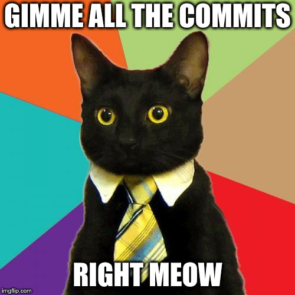

# YO 
- 'DIS' is my *readme* file I keep also track on changes :+1:

# Changes
## commit 2 - Task 4
- Changed header structure (acturally wanted to follow a more SEO-focussed approach but from the design perspective, headline split in h1 and h2 looks better)
- added structure

## commit 3 - Task 5
- changed menu to be horizontal (see css) 
- added missing links

## commit 4 - Task 6
- Added div for timeline
- Changed CSS to improve the timeline (without numbering, as the list start with years already, this is more clear

